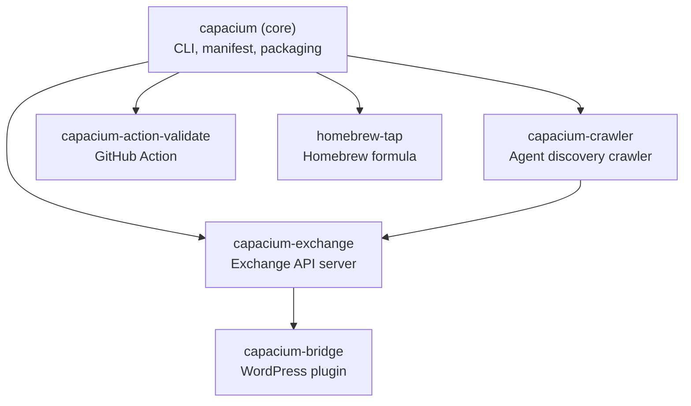

# Capacium Multi-Repo Topology

Capacium is decomposed into **six repositories** that form a hub-and-spoke architecture. The `capacium` core repo is the single dependency hub — every other repo depends on it for the manifest schema, kind enums, and packaging conventions. Downstream repos (`capacium-exchange`, `capacium-crawler`) depend on core and may optionally depend on each other. Platform-specific adapters (`capacium-bridge`, `homebrew-tap`, `capacium-action-validate`) depend only on core and release independently.

## Dependency Graph

## Repository Inventory

| Repo | Domain | Stack | CI | Tests | Visibility |
|------|--------|-------|----|-------|------------|
| `capacium` | Core CLI, manifest, packaging, verification, lock system | Python 3.10+ stdlib-only | GitHub Actions | pytest (296+ tests) | public |
| `capacium-exchange` | Exchange API server, listing CRUD, trust state machine, faceted search | FastAPI, SQLAlchemy, PostgreSQL, stdlib | GitHub Actions | pytest + httpx | public |
| `capacium-crawler` | Agent network crawler, GitHub source, normalizer, classifier, dedup | Python 3.10+ stdlib-only (urllib) | GitHub Actions | pytest + responses mock | public |
| `capacium-bridge` | WordPress plugin — Exchange client, listing sync | PHP 8.0+, WordPress plugin API | GitHub Actions (PHPUnit) | PHPUnit | public |
| `homebrew-tap` | Homebrew formula for `cap` CLI | Ruby (Homebrew DSL) | GitHub Actions (brew test-bot) | brew test | public |
| `capacium-action-validate` | GitHub Composite Action for manifest validation | YAML (composite action), Docker | GitHub Actions (self-test) | integration (action self-test) | public |

## Release Coordination Rules

### Require coordinated release
- **capacium + capacium-exchange**: If the manifest schema (`capability.yaml` format, `Kind` enums, or `LockFile` schema) changes in a breaking way, both repos must release together with aligned versions.
- **capacium + capacium-action-validate**: If manifest validation rules change, the action must be updated to match. Non-breaking additions (new optional fields) can release independently.
- **capacium + capacium-crawler**: If `Kind` enums or manifest fields that the classifier depends on are added/removed, coordinate the release.

### Can release independently
- **capacium-bridge**: Depends on the Exchange API contract (OpenAPI spec), not on the core CLI. Can release on its own cadence as long as it targets a stable API version.
- **homebrew-tap**: Purely a packaging formula — only needs updating when `capacium` releases a new version (no code dependency, just version bumps).
- **capacium-crawler → capacium-exchange**: The crawler pushes findings to the Exchange API. If the Exchange API is versioned and backward-compatible, the crawler can release independently.

### Versioning policy
- All repos follow SemVer independently.
- Coordinated releases use the same MAJOR.MINOR version but may differ in PATCH.
- Core schema-breaking changes bump `capacium` MAJOR; downstream repos bump their MAJOR independently if they drop backward compatibility with the old schema.

## CI/CD Independence

| Repo | CI Trigger | Artifacts | Docker | Notes |
|------|-----------|-----------|--------|-------|
| `capacium` | PR + push to main | PyPI package, GitHub release | No | `--skip-runtime-check` on PR CI to avoid host runtime pre-flight |
| `capacium-exchange` | PR + push to main | PyPI package, Docker image | Yes (FastAPI) | Integration tests require PostgreSQL service container |
| `capacium-crawler` | PR + push to main | PyPI package | No | Mocks external APIs in CI (responses library) |
| `capacium-bridge` | PR + push to main | WordPress plugin ZIP | No | PHPUnit tests in CI with WP test suite |
| `homebrew-tap` | New `capacium` release + manual | Formula update PR | No | `brew test-bot` runs in CI |
| `capacium-action-validate` | PR + push to main | Action metadata (action.yml) | Optional Docker | Self-tests via `act` or workflow dispatch |

Each repo's CI pipeline is fully independent. No cross-repo CI triggers exist. When a coordinated release is needed, a human (or release automation) creates aligned tags and publishes in order.

## Contribution Boundaries

### Belongs in `capacium` (core)
- CLI commands (`cap install`, `cap list`, `cap search`, etc.)
- Manifest schema and validation (`capability.yaml`)
- Packaging logic (`cap package`)
- Fingerprint computation and verification
- Lock file generation and enforcement
- Adapter system (framework integrations)
- Runtime resolver (uv, node, python, docker)
- Local registry (SQLite)
- OpenAPI spec for the Exchange API client
- Bundle support (Kind.BUNDLE)

### Belongs in `capacium-exchange`
- Exchange API server (FastAPI routes)
- Listing CRUD operations
- Trust state machine (discovered → indexed → claimed → verified → audited)
- Publisher profiles and verification workflow
- Taxonomy (categories, tags) management
- Curated collections
- Faceted search engine
- Database migrations for the Exchange schema (PostgreSQL)

### Belongs in `capacium-crawler`
- Crawl pipeline orchestration
- Source integrations (GitHub, etc.)
- Metadata normalizer
- Taxonomy and kind classifier
- Deduplication engine
- Claim preparation and owner detection
- Rate limiting and backoff logic

### Belongs in `capacium-bridge`
- WordPress admin UI for Exchange
- Listing sync from Exchange to WordPress
- Shortcodes/blocks for listing display
- WordPress plugin activation/deactivation hooks

### Belongs in `homebrew-tap`
- Homebrew formula for `cap` CLI
- Version bumps when core releases
- No code beyond the Ruby formula DSL

### Belongs in `capacium-action-validate`
- Composite action YAML (`action.yml`)
- Validation entrypoint (Docker or shell)
- Action metadata (inputs, outputs, branding)

### Ambiguous cases
- **CLI → Exchange REST client**: The client model classes live in `capacium` (shared with the CLI). HTTP transport lives in `capacium`. The Exchange API routes live in `capacium-exchange`. This split keeps the core stdlib-only.
- **Shared types**: `Kind`, `TrustState`, `Capability` model, `Listing` — currently defined in `capacium` and imported by other repos via PyPI dependency. If drift becomes problematic, consider extracting a `capacium-types` shared library.

## Naming Conventions

| Convention | Rule |
|-----------|------|
| GitHub repo names | `capacium-{subsystem}` — lowercase, hyphen-separated. Exceptions: `homebrew-tap` (Homebrew convention). |
| PyPI package names | `capacium` (core), `capacium-exchange`, `capacium-crawler` |
| Docker images | `ghcr.io/anomalyco/capacium-exchange` — lowercase, repo-scoped |
| WordPress plugin slug | `capacium-bridge` |
| Homebrew tap | `homebrew-tap` (repo name), formula is `cap` |
| GitHub Action | `capacium-action-validate` — action path: `anomalyco/capacium-action-validate@v1` |
| Git tags | `v1.2.3` in all repos. Coordinated releases share the MAJOR.MINOR across repos. |
| Release names | `Capacium Exchange v1.2.3`, `Capacium Core v1.2.3` — prefix with `Capacium` + subsystem name. |
